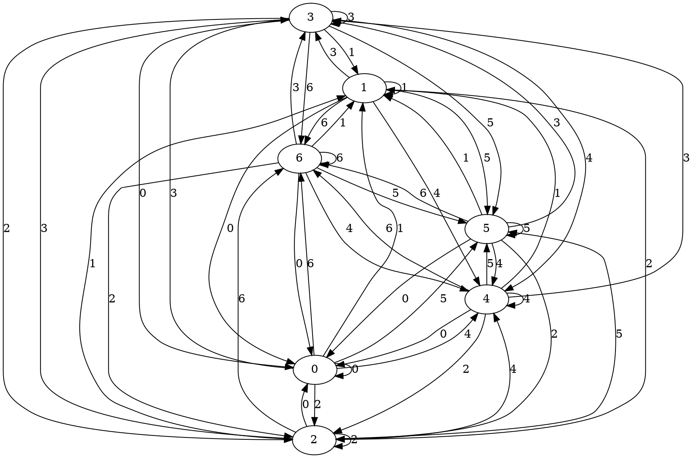

```graphviz
digraph "" {
	graph [bb="0,0,823,568.8"];
	node [label="\N"];
	3	 [height=0.5,
		pos="375,550.8",
		width=0.75];
	3 -> 3	 [label=3,
		lp="423.5,550.8",
		pos="e,399.53,542.68 399.53,558.92 410.51,559.69 420,556.99 420,550.8 420,546.64 415.72,544.06 409.57,543.04"];
	1	 [height=0.5,
		pos="435,462",
		width=0.75];
	3 -> 1	 [label=1,
		lp="421.5,506.4",
		pos="e,427.37,479.79 390.43,535.81 396.33,529.62 402.87,522.18 408,514.8 413.55,506.81 418.68,497.53 422.94,489"];
	2	 [height=0.5,
		pos="376,18",
		width=0.75];
	3 -> 2	 [label=2,
		lp="3.5,284.4",
		pos="e,348.96,18.591 347.73,550.19 261.43,547.51 0,533.5 0,462 0,462 0,462 0,106.8 0,37.625 244.1,22.274 338.94,18.92"];
	0	 [height=0.5,
		pos="376,106.8",
		width=0.75];
	3 -> 0	 [label=0,
		lp="165.5,328.8",
		pos="e,349.59,110.66 348.58,546.97 308.41,540.82 234.22,528.08 211,514.8 183.21,498.91 162,494.01 162,462 162,462 162,462 162,195.6 162,\
163.28 183.86,158.7 212,142.8 233.47,130.67 298.17,118.85 339.6,112.23"];
	4	 [height=0.5,
		pos="579,195.6",
		width=0.75];
	3 -> 4	 [label=4,
		lp="715.5,373.2",
		pos="e,601.14,205.97 401.92,549.36 462.08,545.82 605.54,535.4 649,514.8 669.4,505.13 673.68,498.92 686,480 716.65,432.93 718.65,409.93 \
706,355.2 691.88,294.11 682.68,275.58 638,231.6 629.9,223.63 619.72,216.63 610.1,210.97"];
	5	 [height=0.5,
		pos="579,284.4",
		width=0.75];
	3 -> 5	 [label=5,
		lp="572.5,417.6",
		pos="e,584.36,302.18 398.27,541.3 443.51,521.37 542.21,470.37 580,391.2 593.64,362.62 591.87,351.83 588,320.4 587.66,317.68 587.19,314.86 \
586.64,312.06"];
	6	 [height=0.5,
		pos="358,373.2",
		width=0.75];
	3 -> 6	 [label=6,
		lp="371.5,462",
		pos="e,359.73,391.25 373.28,532.79 370.31,501.81 364.22,438.21 360.69,401.33"];
	1 -> 3	 [label=3,
		lp="403.5,506.4",
		pos="e,381.74,532.89 418.81,476.43 412.44,482.65 405.37,490.27 400,498 394.54,505.87 389.7,515.12 385.78,523.66"];
	1 -> 1	 [label=1,
		lp="483.5,462",
		pos="e,459.53,453.88 459.53,470.12 470.51,470.89 480,468.19 480,462 480,457.84 475.72,455.26 469.57,454.24"];
	1 -> 2	 [label=2,
		lp="773.5,240",
		pos="e,402.77,21.166 462.09,459.23 526.1,452.57 682.96,435.51 705,426 739.17,411.25 770,410.42 770,373.2 770,373.2 770,373.2 770,106.8 \
770,70.394 510.69,34.614 412.81,22.405"];
	1 -> 0	 [label=0,
		lp="303.5,284.4",
		pos="e,356.94,119.59 411.05,453.6 384.94,443.16 343.93,422.76 322,391.2 298.79,357.81 304.93,342.76 300,302.4 293.26,247.2 290.85,230.17 \
309,177.6 316.22,156.68 333.55,138.66 348.78,126.03"];
	1 -> 4	 [label=4,
		lp="520.5,328.8",
		pos="e,570.16,212.71 445.53,445.31 460.33,421.62 487.84,376.73 509,337.2 525.47,306.42 527.53,297.69 543,266.4 550.33,251.58 558.69,235.11 \
565.51,221.79"];
	1 -> 5	 [label=5,
		lp="572.5,373.2",
		pos="e,578.08,302.42 460.51,455.71 489.95,446.9 536.75,427.69 556,391.2 569.01,366.55 574.66,335.01 577.12,312.61"];
	1 -> 6	 [label=6,
		lp="392.5,417.6",
		pos="e,366.02,390.44 415.27,449.09 406.57,442.79 396.61,434.7 389,426 382.04,418.04 375.81,408.3 370.79,399.36"];
	2 -> 3	 [label=3,
		lp="46.5,284.4",
		pos="e,347.83,549.37 349.03,19.398 269.76,24.237 43,43.602 43,106.8 43,462 43,462 43,462 43,522.43 250.84,542.82 337.63,548.71"];
	2 -> 1	 [label=1,
		lp="98.5,240",
		pos="e,410.52,453.84 348.75,19.455 303.33,23.313 211.81,37.398 158,88.8 102.86,141.48 90.088,172.3 95,248.4 97.674,289.83 92.364,310.31 \
124,337.2 200.9,402.56 238.92,389.45 333,426 355.46,434.73 381.03,443.75 400.95,450.58"];
	2 -> 2	 [label=2,
		lp="424.5,18",
		pos="e,400.53,9.8789 400.53,26.121 411.51,26.895 421,24.188 421,18 421,13.843 416.72,11.257 410.57,10.242"];
	2 -> 0	 [label=0,
		lp="367.5,62.4",
		pos="e,368.86,89.14 368.86,35.66 366.87,41.41 364.99,47.887 364,54 362.8,61.37 362.8,63.43 364,70.8 364.46,73.665 365.13,76.611 365.9,\
79.524"];
	2 -> 4	 [label=4,
		lp="583.5,106.8",
		pos="e,580.82,177.3 402.7,21.156 442.37,27.229 516.8,44.158 560,88.8 582.91,112.48 583.37,126.68 582,159.6 581.9,162.03 581.76,164.55 \
581.6,167.08"];
	2 -> 5	 [label=5,
		lp="665.5,151.2",
		pos="e,601.41,274.3 403.02,19.704 441.06,22.842 512.01,31.431 568,54 594.14,64.535 601.4,68.553 621,88.8 661.15,130.28 671.28,157.66 \
657,213.6 652.64,230.67 650.16,235.64 638,248.4 630.16,256.63 620.04,263.7 610.41,269.34"];
	2 -> 6	 [label=6,
		lp="321.5,195.6",
		pos="e,345.74,356.93 365.99,34.96 358.04,49.001 347.12,69.676 340,88.8 325.8,126.9 322.93,137.24 318,177.6 309.36,248.36 303.18,272.92 \
334,337.2 335.78,340.9 337.89,344.67 340.11,348.3"];
	0 -> 3	 [label=3,
		lp="203.5,328.8",
		pos="e,348.04,549.23 348.89,108.32 299.52,112.71 200,129.72 200,195.6 200,462 200,462 200,462 200,523.36 286.61,542.33 337.97,548.19"];
	0 -> 1	 [label=1,
		lp="473.5,284.4",
		pos="e,433.97,443.72 385.99,123.78 409.2,163.28 464.93,258.6 467,266.4 471.1,281.87 472.45,287.36 467,302.4 463.45,312.19 456.12,310.84 \
452,320.4 436.11,357.25 433.53,404.21 433.77,433.7"];
	0 -> 2	 [label=2,
		lp="379.5,62.4",
		pos="e,376,36.072 376,88.401 376,76.295 376,60.208 376,46.467"];
	0 -> 0	 [label=0,
		lp="424.5,106.8",
		pos="e,400.53,98.679 400.53,114.92 411.51,115.69 421,112.99 421,106.8 421,102.64 416.72,100.06 410.57,99.042"];
	0 -> 4	 [label=4,
		lp="556.5,151.2",
		pos="e,569.19,178.78 402.67,110.71 441.94,116.83 513.03,129.35 535,142.8 546.18,149.64 555.86,160.33 563.28,170.31"];
	0 -> 5	 [label=5,
		lp="526.5,195.6",
		pos="e,567.57,267.83 397.75,117.78 421.55,130.38 460.16,152.55 489,177.6 517.57,202.41 544.75,236.66 561.62,259.62"];
	0 -> 6	 [label=6,
		lp="370.5,240",
		pos="e,359.24,354.89 374.78,124.89 371.7,170.38 363.63,289.85 359.92,344.8"];
	4 -> 3	 [label=3,
		lp="819.5,373.2",
		pos="e,402.06,550.17 605.95,197.77 654.11,202.08 752.56,212.93 781,231.6 804.54,247.05 816,256.25 816,284.4 816,462 816,462 816,462 816,\
499.91 784.18,500.68 749,514.8 688.47,539.1 494.27,547.4 412.19,549.87"];
	4 -> 1	 [label=1,
		lp="662.5,328.8",
		pos="e,462.24,460.64 596.48,209.46 611.26,222.39 631.36,243.13 640,266.4 664.82,333.23 672.89,374.11 624,426 603.78,447.46 521.56,456.44 \
472.47,459.95"];
	4 -> 2	 [label=2,
		lp="552.5,106.8",
		pos="e,399.55,27.149 577.07,177.59 575.17,166.68 571.42,152.96 564,142.8 523.7,87.62 451.05,49.7 408.83,31.134"];
	4 -> 0	 [label=0,
		lp="531.5,151.2",
		pos="e,402.16,111.32 560.9,182.19 540.98,167.5 510.98,145.66 505,142.8 475.18,128.55 438.71,119.02 412.16,113.37"];
	4 -> 4	 [label=4,
		lp="627.5,195.6",
		pos="e,603.53,187.48 603.53,203.72 614.51,204.49 624,201.79 624,195.6 624,191.44 619.72,188.86 613.57,187.84"];
	4 -> 5	 [label=5,
		lp="582.5,240",
		pos="e,579,266 579,213.67 579,225.82 579,242.1 579,255.97"];
	4 -> 6	 [label=6,
		lp="463.5,284.4",
		pos="e,372.61,357.61 556.4,205.66 541.94,212.4 522.96,221.8 507,231.6 484.85,245.2 479.49,249.21 460,266.4 451.57,273.83 406.84,321.18 \
379.49,350.28"];
	5 -> 3	 [label=3,
		lp="697.5,417.6",
		pos="e,402.16,548.64 605.94,287.04 627.28,290.7 655.77,299.46 670,320.4 719.75,393.58 692.49,455.29 627,514.8 611.36,529.01 478.42,542.08 \
412.19,547.78"];
	5 -> 1	 [label=1,
		lp="548.5,373.2",
		pos="e,458.93,453.46 571.28,301.68 556.12,335.07 522.24,406.87 503,426 493.21,435.74 480.24,443.48 468.25,449.25"];
	5 -> 2	 [label=2,
		lp="646.5,151.2",
		pos="e,402.71,20.928 596.48,270.54 611.26,257.61 631.36,236.87 640,213.6 660.75,157.74 631.49,132.52 591,88.8 571.85,68.124 563.96,64.969 \
538,54 497.05,36.695 446.61,27.172 413,22.337"];
	5 -> 0	 [label=0,
		lp="485.5,195.6",
		pos="e,390.03,122.43 559.73,271.68 539.66,258.12 507.62,235.61 482,213.6 450.63,186.64 417.51,152.18 396.81,129.8"];
	5 -> 4	 [label=4,
		lp="590.5,240",
		pos="e,583.77,213.42 583.77,266.58 585.09,260.83 586.34,254.38 587,248.4 587.81,240.98 587.81,239.02 587,231.6 586.7,228.89 586.28,226.08 \
585.79,223.29"];
	5 -> 5	 [label=5,
		lp="627.5,284.4",
		pos="e,603.53,276.28 603.53,292.52 614.51,293.29 624,290.59 624,284.4 624,280.24 619.72,277.66 613.57,276.64"];
	5 -> 6	 [label=6,
		lp="507.5,328.8",
		pos="e,383.85,367.9 556.25,294.29 541.15,301.1 521.05,310.65 504,320.4 492.38,327.05 491.11,331.49 479,337.2 451.59,350.12 418.5,359.58 \
393.85,365.56"];
	6 -> 3	 [label=3,
		lp="327.5,462",
		pos="e,358.19,536.54 348.64,390.27 345.47,396.21 341.99,402.95 339,409.2 325.12,438.21 317.5,448.5 324,480 327.4,496.49 329.54,500.86 \
339,514.8 342.43,519.86 346.64,524.81 350.95,529.35"];
	6 -> 1	 [label=1,
		lp="409.5,417.6",
		pos="e,422.95,445.4 373.85,388.21 380.29,394.52 387.69,402.04 394,409.2 401.8,418.04 409.86,428.17 416.75,437.18"];
	6 -> 2	 [label=2,
		lp="130.5,195.6",
		pos="e,350.29,23.539 331.44,368.62 310,364.94 279.07,359.67 252,355.2 227.13,351.09 156.35,356.39 140,337.2 83.915,271.38 101.33,215.6 \
148,142.8 192.18,73.884 288.23,39.971 340.46,26.059"];
	6 -> 0	 [label=0,
		lp="331.5,240",
		pos="e,359.35,121.08 349.86,355.91 347.36,350.07 344.8,343.44 343,337.2 329.85,291.66 324.04,278.84 328,231.6 331.35,191.71 325.42,178.76 \
343,142.8 345.47,137.75 348.87,132.91 352.55,128.5"];
	6 -> 4	 [label=4,
		lp="417.5,284.4",
		pos="e,556.34,205.41 364.25,355.44 376.58,323.52 407.42,257.4 459,231.6 489.66,216.27 501.33,223.99 534,213.6 538.15,212.28 542.46,210.76 \
546.7,209.17"];
	6 -> 5	 [label=5,
		lp="477.5,328.8",
		pos="e,554.14,292.17 379.96,362.43 403.09,351.28 440.69,333.65 474,320.4 497.23,311.15 523.89,302.03 544.53,295.28"];
	6 -> 6	 [label=6,
		lp="406.5,373.2",
		pos="e,382.53,365.08 382.53,381.32 393.51,382.09 403,379.39 403,373.2 403,369.04 398.72,366.46 392.57,365.44"];
}
```